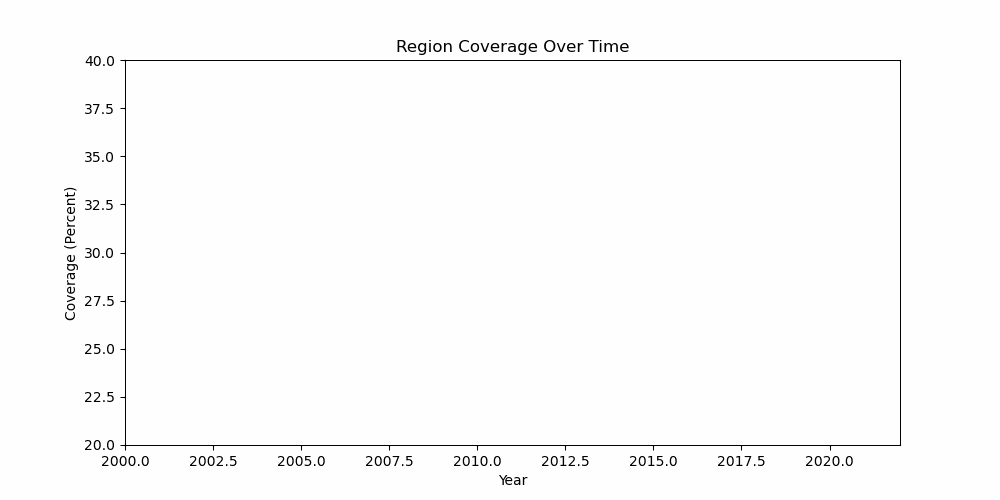
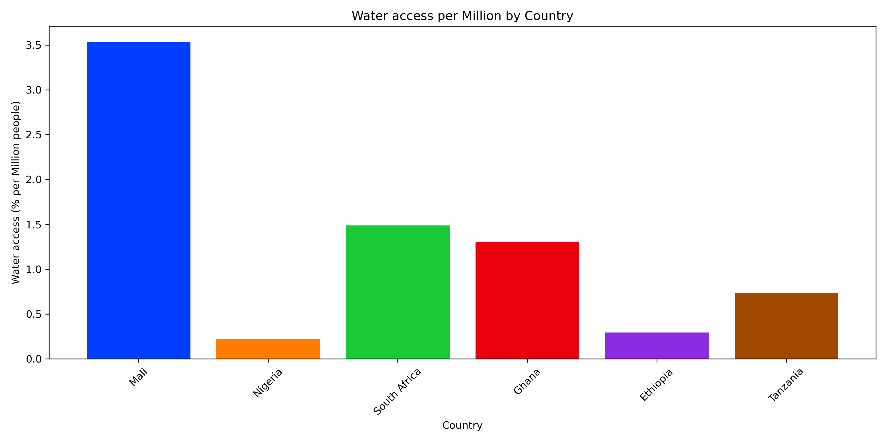

# Projects

- Water Access Analysis of Sub-Saharan Africa

In this project our team was tasked with taking data from the JMP water database, analysing and presenting it. We focused on basic water access
within the Sub-Saharan Region of Africa. We cleaned data and organized it all within python, and then created visually appealing charts to present
our findings. Through our data analysis of accessible drinking water throughout the continent of Africa, the chart shows that countries with accessible drinking water tend to also have higher GDPs. However, some outliers are Mali, a country with high access to water but low GDP. Mali is a prime example of a basic accessible water country. Most of its water can be taken from streams or rivers. Most of the country also avoids the desert regions and migrate to South Mali. In this project I learned how to clean, organize and analyse data from any given source. I gained critical skills in python and data interpretation. 
